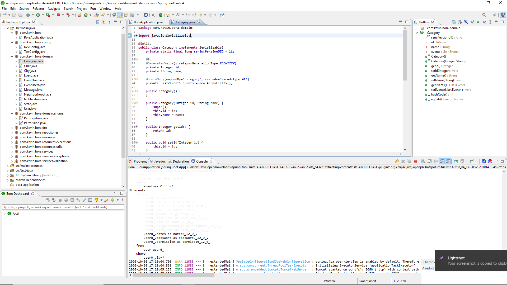
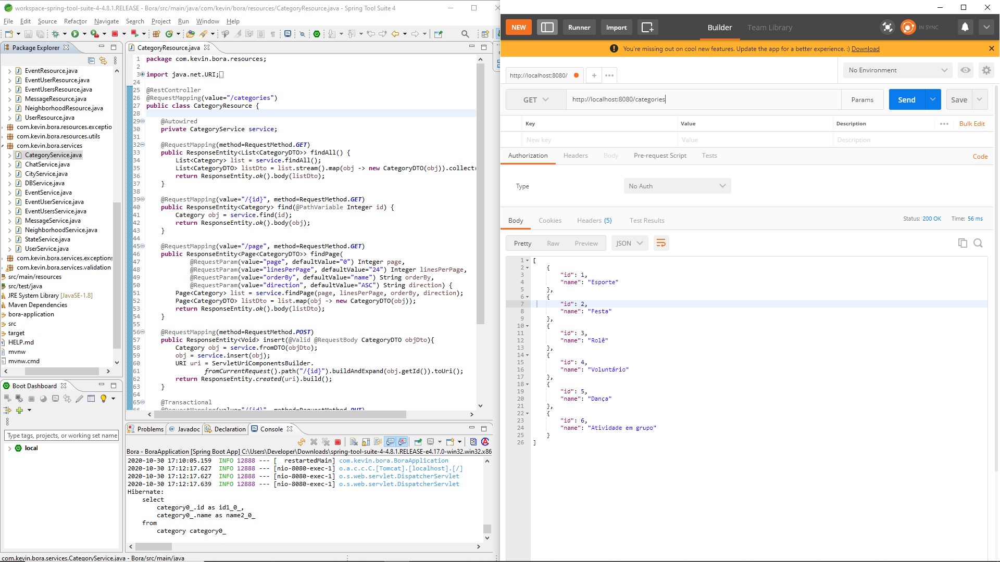

# BoraJava

## Description

Bora is a platform to find atividades like football, volleyball, party and others around your city.

## How to Run it

To run it you will need to have Java 8 installed and SpringToolSuite on your computer,
you can download Java on Oracle site and SpringToolSuite on https://spring.io/tools

Open this project on SpringToolSuite and wait STS update with maven, then you can run as 
Spring Boot App it on H2
database or you can change to MySQL, which is pre-instaled

## Technologies

Java With Spring and Hibernate, Spring Boot, MySql, Sql, STS, H2, Postman.

## License
[GPL-3.0](https://www.gnu.org/licenses/gpl-3.0.en.html)
